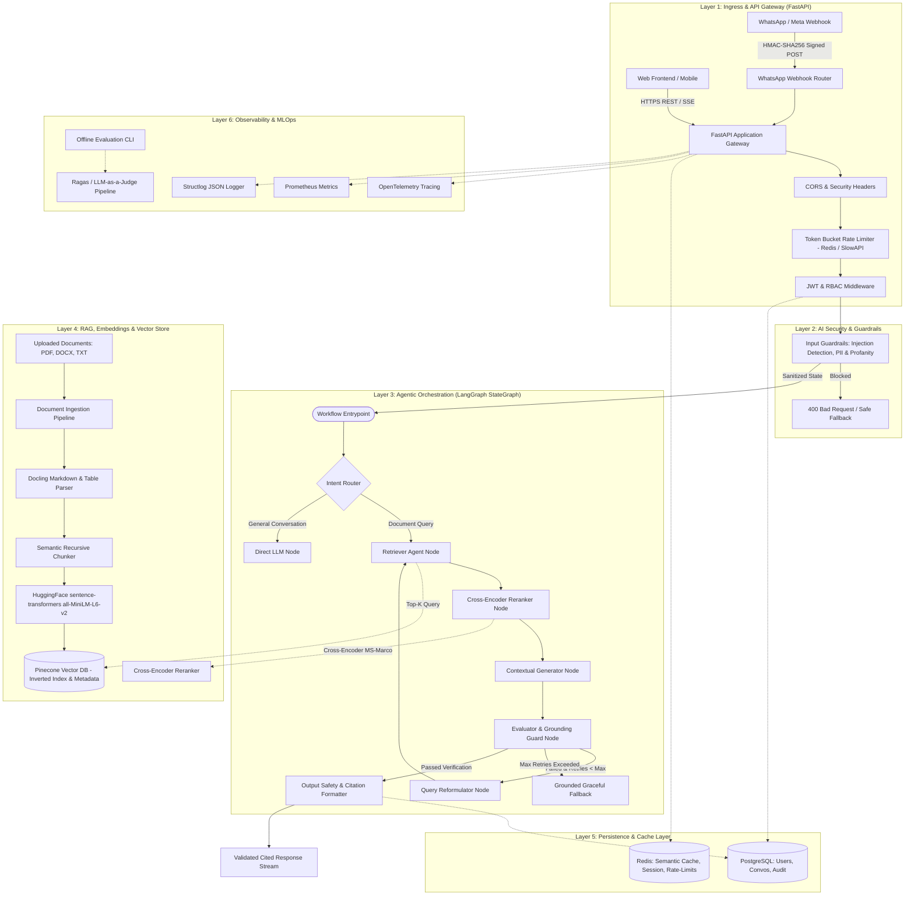
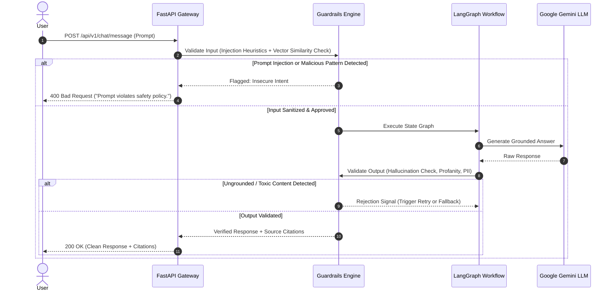
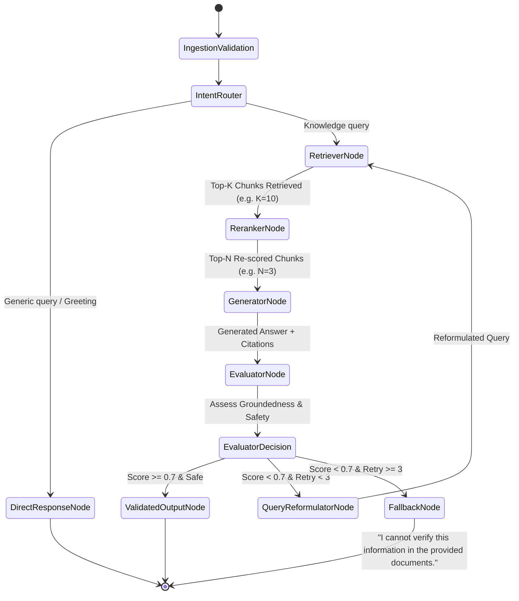
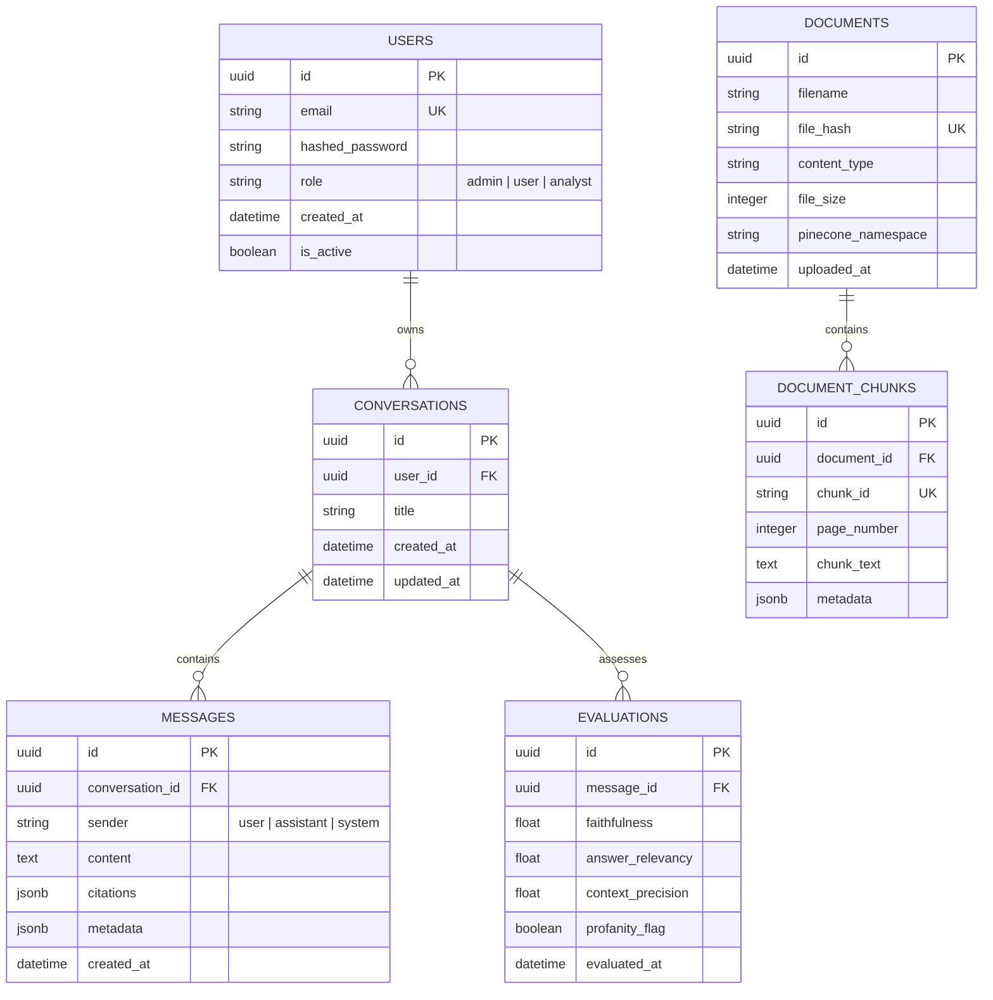
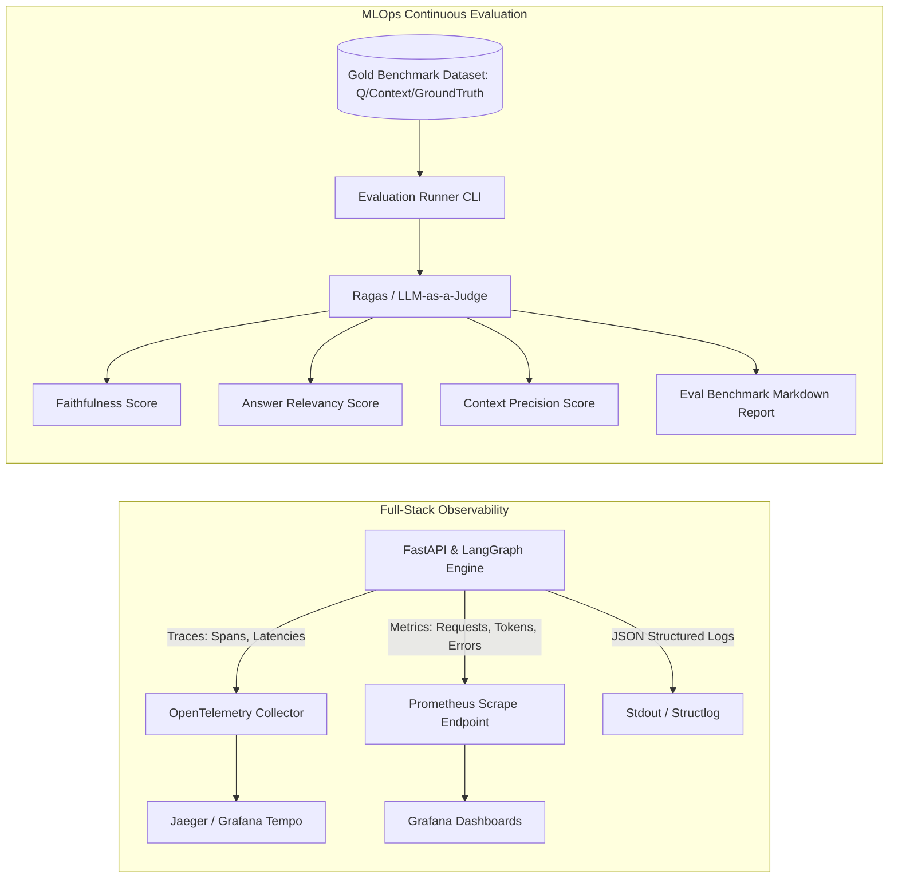

# DocuChat-AI — Enterprise Production Architecture (Target Specification)
**Version:** 2.0.0  
**Status:** Approved Target Blueprint  
**Authors:** Senior AI/ML & Platform Architecture Team  

---

## 1. Executive Architecture Overview

DocuChat-AI is an enterprise-grade, agentic **Retrieval-Augmented Generation (RAG)** platform designed to ingest unstructured documents, perform high-precision hybrid/dense semantic search with reranking, execute multi-step reasoning workflows via **LangGraph**, enforce strict AI safety and guardrails, and deliver grounded, cited responses across both **REST APIs** and **WhatsApp webhooks**.

### Core Architecture Principles
1. **Groundedness & Zero-Hallucination Enforced by Design**: Every LLM generation is conditioned on verified vector retrieval, reranked by cross-encoders, and evaluated by an autonomous guard node before reaching the user.
2. **Layered Separation of Concerns**: Clean hexagonal/layered architecture decoupling Presentation (FastAPI), Orchestration (LangGraph), Knowledge (Pinecone/Docling), Security (Guardrails/JWT), and Persistence (PostgreSQL/Redis).
3. **Resilience & Self-Correction**: Agentic feedback loops retry queries with query-rewriting if context retrieval or safety validation fails, bounded by configurable maximum retry limits.
4. **End-to-End Observability**: Distributed tracing via OpenTelemetry, metrics exported to Prometheus, and structured audit logs tracking prompt tokens, generation latency, and safety verdicts.
5. **Production MLOps**: Continuous evaluation pipelines (LLM-as-a-judge & Ragas metrics) validating retrieval precision, faithfulness, and answer relevancy against gold standard benchmarks.

---

## 2. End-to-End System Topology



---

## 3. Detailed Subsystem Specifications

### 3.1 Layer 1: Ingress & API Gateway (FastAPI)
- **Unified Application Core**: Eliminate code duplication between `main.py` and `chatbotapi.py`. A single unified FastAPI application instance configured in `src/api/app.py` exposes modular APIRouters under `/api/v1`:
  - `/api/v1/auth`: User registration, login, token refresh, and profile management.
  - `/api/v1/chat`: Streaming and standard chat endpoints, conversation thread management.
  - `/api/v1/documents`: Document upload, indexing status, deletion, and chunk inspection.
  - `/api/v1/eval`: Trigger evaluation runs and view historical quality metrics.
  - `/api/v1/health`: Liveness and readiness probes checking DB, Redis, and Pinecone health.
  - `/webhooks/whatsapp`: Secure webhook verification (`GET`) and message ingestion (`POST`).
- **Standardized Exception Handling**: Implements RFC 7807 (Problem Details for HTTP APIs) with consistent error schemas:
  ```json
  {
    "type": "https://docuchat.ai/errors/retrieval-failed",
    "title": "Document Retrieval Error",
    "status": 502,
    "detail": "Vector index timed out while querying namespace 'default'.",
    "instance": "/api/v1/chat/message",
    "timestamp": "2026-09-12T10:50:00Z"
  }
  ```
- **WhatsApp Webhook Security**: Replaces hardcoded verification tokens with environment variables (`WHATSAPP_VERIFY_TOKEN`, `WHATSAPP_APP_SECRET`). Inbound messages undergo cryptographic HMAC-SHA256 signature verification (`X-Hub-Signature-256`) to guarantee authenticity.

---

### 3.2 Layer 2: AI Security & Guardrails



- **OWASP Top 10 for LLM Defense Matrix**:
  1. **LLM01: Prompt Injection**: Dual-phase filtering (regex heuristic for jailbreaks, plus embedding cosine distance against known jailbreak pattern vectors).
  2. **LLM02: Sensitive Information Disclosure**: PII scrubbing (regex patterns for emails, SSNs, credit cards, phone numbers, and secrets) prior to vector indexing and LLM prompt construction.
  3. **LLM06: Excessive Agency**: LangGraph nodes execute with isolated, immutable tool permissions. SimpleExecutor cannot execute arbitrary shell or DB commands.
  4. **LLM09: Overreliance / Hallucination**: Evaluator node cross-checks generated sentences against retrieved context chunks using NLI (Natural Language Inference) or LLM evaluation before emitting the payload.

---

### 3.3 Layer 3: LangGraph Agentic Orchestration

The system utilizes a directed acyclic graph (with conditional retry cycles) implemented with LangGraph `StateGraph`.



#### Graph State Schema (`src/schemas/graph_state.py`)
```python
from typing import List, Dict, Any, Optional
from typing_extensions import TypedDict

class DocumentChunk(TypedDict):
    chunk_id: str
    source_document: str
    page_number: Optional[int]
    content: str
    relevance_score: float

class EvaluationResult(TypedDict):
    groundedness_score: float
    relevance_score: float
    is_safe: bool
    critique: Optional[str]

class AgentState(TypedDict):
    conversation_id: str
    user_id: str
    raw_query: str
    reformulated_query: Optional[str]
    retrieved_documents: List[DocumentChunk]
    generated_answer: Optional[str]
    citations: List[Dict[str, Any]]
    evaluation: Optional[EvaluationResult]
    retry_count: int
    max_retries: int
    error: Optional[str]
```

---

### 3.4 Layer 4: Advanced RAG Subsystem

1. **Document Ingestion & Chunking**:
   - Uses `docling` to extract rich hierarchical structure, markdown tables, and headers from PDF documents.
   - Text splitter: `RecursiveCharacterTextSplitter` configured with chunk size of 512 tokens and 64-token overlap, preserving header breadcrumbs in chunk metadata.
2. **Dense Vector Search**:
   - Embeddings: HuggingFace `sentence-transformers/all-MiniLM-L6-v2` (384 dimensions, normalized).
   - Pinecone Vector Database with namespace isolation per workspace/user.
   - Initial retrieval query requests `top_k = 10`.
3. **Cross-Encoder Reranking**:
   - Retrieved chunks pass through a secondary cross-encoder (`cross-encoder/ms-marco-MiniLM-L-6-v2`).
   - The top 3-4 chunks with score above threshold (> 0.25) are packed into the generation prompt, dramatically improving answer relevance and eliminating context dilution.
4. **Deterministic Citation Tracking**:
   - Chunks are numbered in the prompt: `[Doc 1: {source}, p.{page}]`.
   - The LLM is instructed via few-shot prompts to cite inline tags like `[Doc 1]`.
   - The citation extractor matches tags against `DocumentChunk` metadata to produce verified clickable citations in the API response.

---

### 3.5 Layer 5: Data & Persistence



- **Redis Multi-Tier Caching**:
  - **Query Cache**: Exact SHA-256 hash match on query string + document namespace stores the generated response for 1 hour (TTL).
  - **Embedding Cache**: Cached 384-dim embedding vectors for frequent queries avoid unnecessary local inference overhead.
  - **Rate Limit Counters**: Token-bucket sliding window state keyed by client IP / user ID.

---

### 3.6 Layer 6: Observability, Tracing & Model Evaluation



#### Key Prometheus Metrics
- `docuchat_requests_total{endpoint, method, status}`: API request throughput and HTTP status distributions.
- `docuchat_llm_latency_seconds{model, node}`: Histogram of LLM generation duration per agent node.
- `docuchat_retrieval_latency_seconds`: Latency breakdown for Pinecone vector query and cross-encoder rerank.
- `docuchat_rag_faithfulness_ratio`: Running average of grounding / faithfulness score evaluated across requests.
- `docuchat_token_usage_total{type="input|output", model}`: Token consumption tracking for cost modeling.

---

## 4. Target Clean Repository Directory Structure

```
DocuChat-AI/
├── .github/
│   └── workflows/
│       ├── ci.yml                 # Automated testing, linting, type-checking
│       └── eval.yml               # Automated RAG regression benchmark run
├── src/
│   ├── api/                       # API layer (FastAPI)
│   │   ├── __init__.py
│   │   ├── app.py                 # Application factory, lifespan, CORS, middleware
│   │   ├── dependencies.py        # Auth, DB session, Redis, service dependencies
│   │   └── v1/
│   │       ├── __init__.py
│   │       ├── router.py          # Unified v1 router
│   │       ├── auth.py            # Authentication & RBAC endpoints
│   │       ├── chat.py            # Chat & streaming endpoints
│   │       ├── documents.py       # Document upload & management endpoints
│   │       ├── eval.py            # Model evaluation inspection endpoints
│   │       ├── health.py          # Liveness & readiness probes
│   │       └── whatsapp.py        # Secure WhatsApp webhook endpoint
│   ├── core/                      # System configuration & foundational utilities
│   │   ├── __init__.py
│   │   ├── config.py              # Pydantic v2 BaseSettings with typed env vars
│   │   ├── logging.py             # Structlog configuration with JSON formatters
│   │   ├── telemetry.py           # OpenTelemetry & Prometheus instrumentation
│   │   └── security.py           # Password hashing, JWT signing & verification
│   ├── guardrails/                # AI Safety & Security
│   │   ├── __init__.py
│   │   ├── input_guard.py         # Prompt injection & jailbreak detection
│   │   ├── output_guard.py        # Hallucination, PII & profanity verification
│   │   └── sanitizers.py          # Text sanitization & escaping routines
│   ├── rag/                       # RAG & Knowledge Retrieval Subsystem
│   │   ├── __init__.py
│   │   ├── loaders/               # Document ingestion strategies (Docling, PDF)
│   │   │   ├── __init__.py
│   │   │   ├── base.py
│   │   │   └── docling_loader.py
│   │   ├── chunking/              # Chunking and text splitting logic
│   │   │   ├── __init__.py
│   │   │   └── semantic_chunker.py
│   │   ├── embeddings/            # Embedding provider abstraction
│   │   │   ├── __init__.py
│   │   │   └── sentence_transformer.py
│   │   ├── vector_stores/         # Vector index strategies
│   │   │   ├── __init__.py
│   │   │   ├── base.py
│   │   │   └── pinecone_store.py
│   │   ├── rerankers/             # Cross-encoder rerankers
│   │   │   ├── __init__.py
│   │   │   └── cross_encoder.py
│   │   └── citation.py            # Citation extraction & link engine
│   ├── workflow/                  # LangGraph Agentic Orchestration
│   │   ├── __init__.py
│   │   ├── graph.py               # StateGraph compilation & edge definitions
│   │   ├── state.py               # AgentState TypedDict and validation models
│   │   ├── nodes/                 # Individual workflow nodes
│   │   │   ├── __init__.py
│   │   │   ├── router_node.py
│   │   │   ├── retriever_node.py
│   │   │   ├── reranker_node.py
│   │   │   ├── generator_node.py
│   │   │   ├── evaluator_node.py
│   │   │   └── fallback_node.py
│   │   └── prompts/               # Prompt templates & versioned YAML specs
│   │       ├── prompts.yml
│   │       └── prompt_manager.py
│   ├── db/                        # Database ORM & Migrations
│   │   ├── __init__.py
│   │   ├── session.py             # Async SQLAlchemy engine & session factory
│   │   ├── models/                # SQLAlchemy models (User, Conversation, Message, etc.)
│   │   │   ├── __init__.py
│   │   │   ├── user.py
│   │   │   ├── conversation.py
│   │   │   ├── document.py
│   │   │   └── evaluation.py
│   │   └── migrations/            # Alembic migration scripts
│   ├── cache/                     # Redis Caching Layer
│   │   ├── __init__.py
│   │   ├── redis_client.py
│   │   └── cache_manager.py       # Semantic query cache & rate limiter helper
│   ├── evaluation/                # Continuous Evaluation & Benchmark Suite
│   │   ├── __init__.py
│   │   ├── runner.py              # CLI & programmatic eval runner
│   │   ├── metrics.py             # Faithfulness, Answer Relevancy, Precision
│   │   └── datasets/              # Evaluation benchmark datasets (JSONL)
│   │       └── gold_benchmark.jsonl
│   └── schemas/                   # Pydantic Request/Response DTOs
│       ├── __init__.py
│       ├── chat.py
│       ├── documents.py
│       ├── auth.py
│       └── eval.py
├── tests/                         # Comprehensive Automated Test Suite
│   ├── conftest.py                # Pytest fixtures, mock LLMs & DB
│   ├── unit/                      # Fast unit tests
│   │   ├── test_guardrails.py
│   │   ├── test_chunking.py
│   │   ├── test_prompt_manager.py
│   │   └── test_workflow_nodes.py
│   ├── integration/               # Integration tests (mocked I/O)
│   │   ├── test_api_chat.py
│   │   ├── test_api_documents.py
│   │   └── test_rag_pipeline.py
│   ├── security/                  # Security & penetration tests
│   │   ├── test_prompt_injection.py
│   │   └── test_auth_rbac.py
│   └── eval/                      # Evaluation regression tests
│       └── test_rag_quality.py
├── chatbot_ui/                    # Modern React / Vite / Tailwind UI
│   ├── src/
│   │   ├── components/            # ChatWindow, MessageItem, CitationCard, Uploader
│   │   ├── api/                   # Axios client for backend API
│   │   ├── App.jsx
│   │   └── main.jsx
│   ├── package.json
│   └── vite.config.js
├── docker-compose.yml             # Full local stack: app + postgres + redis
├── Dockerfile                     # Multi-stage security-hardened Docker build
├── pyproject.toml                 # Modern dependencies & tool configuration
├── PROJECT_AUDIT.md               # Approved technical audit & roadmap
├── ARCHITECTURE.md               # This document
└── README.md                      # Comprehensive production documentation
```

---

## 5. Security & Compliance Architecture

| Area | Threat Model | Mitigation Strategy | Implementation File |
|---|---|---|---|
| **API Auth** | Unauthorized access, token forgery | JWT with RS256 / HS256, bcrypt password hashing, token expiration | `src/core/security.py` |
| **RBAC** | Privilege escalation | Role annotations (`admin`, `user`) checked in dependency injection | `src/api/dependencies.py` |
| **Rate Limiting** | DoS, brute force, LLM wallet exhaustion | Token bucket rate limiting backed by Redis; 30 req/min per IP | `src/cache/cache_manager.py` |
| **Webhooks** | Spoofed WhatsApp messages | Cryptographic HMAC-SHA256 signature verification | `src/api/v1/whatsapp.py` |
| **Vector Injection** | Poisoned document chunks | Content sanitization on ingestion; chunk hash deduplication | `src/rag/loaders/` |
| **Prompt Injection** | System prompt override, jailbreaking | Regex pattern checks + semantic distance guardrails | `src/guardrails/input_guard.py` |
| **Hallucination** | Fabricated facts presented to user | Evaluator node grounding validation + citation verification | `src/workflow/nodes/evaluator_node.py` |
| **Secrets Management**| Leaked API keys in repo or docker | `pydantic-settings` reading from `.env` or container secrets | `src/core/config.py` |

---

## 6. Verification and Acceptance Criteria

1. **Bug Resolution**: Elimination of all hardcoded Windows paths, singleton re-init errors, and import-time execution side-effects.
2. **Unified API**: All endpoints accessible under `/api/v1` with automated Swagger/OpenAPI docs at `/docs`.
3. **RAG Precision**: Vector retrieval returns top-K results, reranked by cross-encoder, with verified citations.
4. **Resilient Agents**: LangGraph state machine handles query reformulation and retries up to 3 times before graceful fallback.
5. **Quality Gate**: Test suite passes with >85% code coverage; RAG evaluation benchmark achieves >0.80 Faithfulness and >0.80 Relevancy.
6. **Containerization**: Single command `docker compose up --build` launches the complete stack (FastAPI, PostgreSQL, Redis) with health checks passing.
