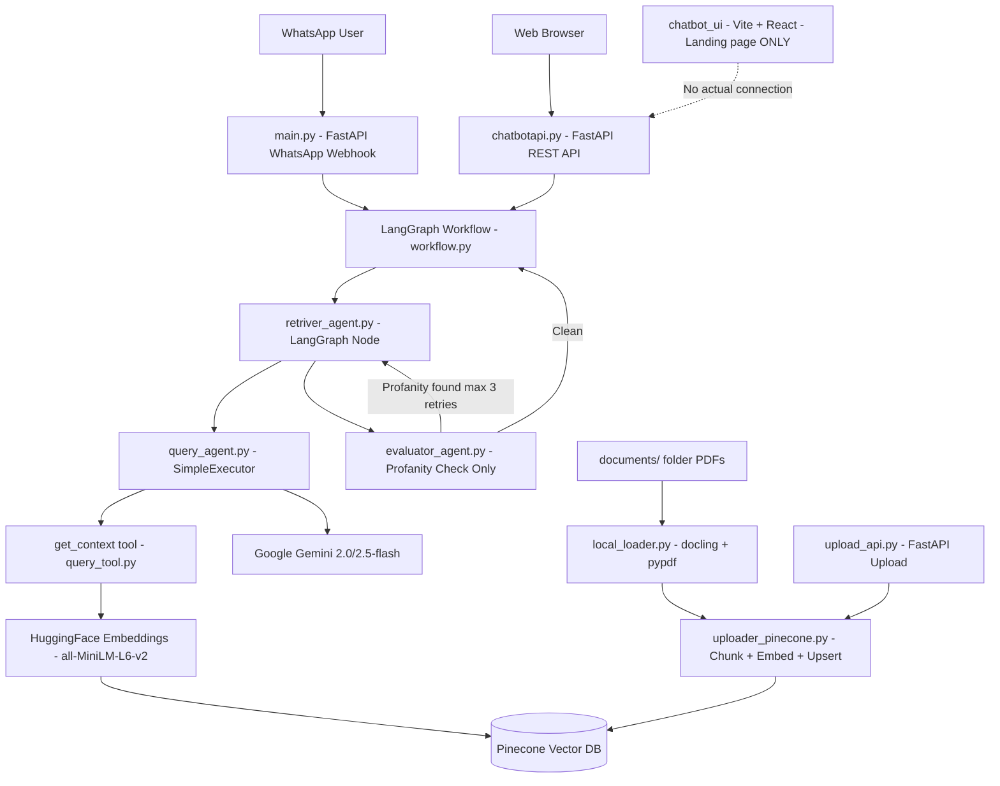
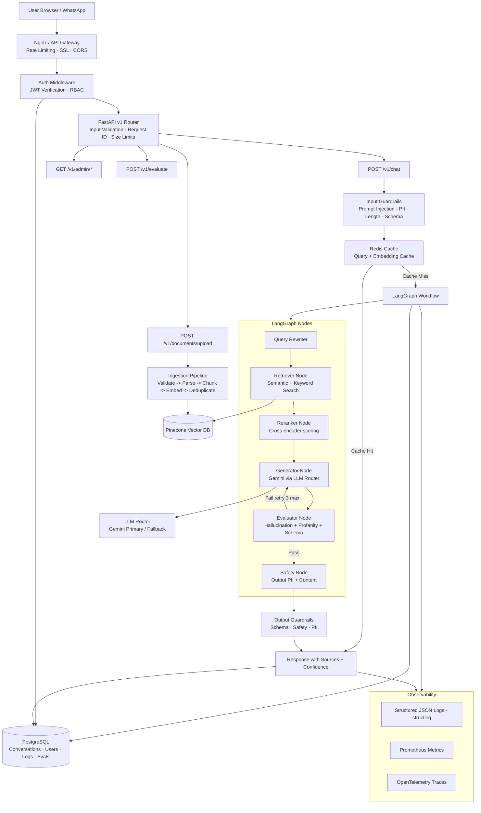

# DocuChat-AI — PROJECT_AUDIT.md
## Phase 0: Technical Audit & Production Roadmap

---

## 1. Executive Summary

DocuChat-AI is a **RAG (Retrieval-Augmented Generation) chatbot** system with a working but prototype-grade implementation. The core pipeline — document ingestion → Pinecone vector search → Google Gemini LLM → profanity-filtered response — is functionally sound. However, the system has **critical security vulnerabilities, architectural debt, zero tests, no authentication, brittle AI response parsing, and a completely non-functional frontend**. It cannot be described as production-ready in any dimension.

This audit defines exactly what needs to change and in what order.

---

## 2. Existing System Architecture (As-Is)

**Key observation**: Two completely separate FastAPI applications (`main.py`, `chatbotapi.py`) with duplicated response-parsing logic. The frontend is a placeholder with zero AI functionality.

---

## 3. Complete File Inventory & Status Assessment

| File | Status | Notes |
|---|---|---|
| `src/main/main.py` | ⚠️ Works / Issues | WhatsApp webhook — brittle regex, hardcoded token, token logged to stdout |
| `src/main/chatbotapi.py` | ⚠️ Works / Issues | Web REST API — duplicated response parsing logic |
| `src/Workflow/workflow.py` | ✅ Functional | LangGraph graph — clean design, but `retry_count` not returned by evaluator |
| `src/agents/retriver_agent.py` | ⚠️ Works | Typo in filename; re-creates query_agent on module load |
| `src/agents/query_agent.py` | ⚠️ Works | `SimpleExecutor` bypasses LangChain agent loop — acceptable pattern |
| `src/agents/evaluator_agent.py` | ⚠️ Works / Incomplete | Only profanity check; does NOT return `retry_count` in state |
| `src/tools/query_tool.py` | ⚠️ Works / Issues | Rebuilds `VectorStoreSingleton` on every call due to singleton bug |
| `src/utils/vector_db/vector_store_singleton.py` | 🔴 Bug | Hardcoded Windows path `F:\...`; singleton `_initialized` guard skips re-init silently |
| `src/utils/vector_db/index_strategies/pinecone_vector_index.py` | ⚠️ Functional | Retrieves only top-1 result despite `top_k=20`; `score_threshold` is not a valid Pinecone SDK param |
| `src/utils/vector_db/index_strategies/base.py` | ✅ Good | Clean ABC abstraction |
| `src/utils/vector_db/loader_strategies/local_loader.py` | 🔴 Bug | Hardcoded Windows path in `__main__` block |
| `src/utils/vector_db/loader_strategies/base.py` | ✅ Good | Clean ABC abstraction |
| `src/Uploader/uploader_pinecone.py` | 🔴 Critical | Top-level code executes Pinecone upsert on import; `MyDocumentUploader` referenced in `upload_api.py` but does not exist here |
| `src/Uploader/upload_api.py` | 🔴 Broken | Imports `MyDocumentUploader` which does not exist |
| `src/document_loader/local_loader.py` | ✅ Good | Clean, well-structured PDF/doc loader |
| `src/schemas/response_schema.py` | ✅ Good | Clean `TypedDict` state definition |
| `src/schemas/evaluation_schema.py` | ⚠️ Stub | Pydantic model defined but never used anywhere |
| `src/utils/prompts.yml` | ⚠️ Incomplete | 4 prompts defined; only `query_agent_prompt` is used |
| `src/utils/yaml_loader.py` | ✅ Good | Simple and clean |
| `src/utils/mermaid_graph_generator.py` | 🔴 Broken | Wrong import path (`agents.Workflow` does not exist) |
| `settings.py` | ⚠️ Acceptable | All env vars via dotenv; `BASE_DIR` defined but never used |
| `chatbot_ui/src/App.jsx` | 🔴 Empty | Landing page scaffold — no chat functionality |
| `chatbot_ui/src/index.css` | ⚠️ Minimal | Just `@import "tailwindcss"` |
| `Dockerfile` | ⚠️ Basic | No multi-stage build, runs as root, no health check |
| `docker-compose.yml` | 🔴 Incomplete | Only `web` service; no Redis, no DB; mounts `./:/app` (exposes secrets) |
| `pyproject.toml` | ⚠️ Bloated | `guardrails-ai`, `opentelemetry`, `llama-index` installed but unused |
| `README.md` | 🔴 Stale | Documents old file structure; missing Workflow, Uploader, chatbot_ui, schemas |

---

## 4. What Already Works

1. **Core RAG loop** — document → Pinecone → Gemini LLM → response is end-to-end functional
2. **LangGraph workflow** — clean `StateGraph` with conditional retry edge
3. **Strategy Pattern** — `DocumentLoaderStrategy` / `VectorIndexStrategy` ABCs are well-designed and extensible
4. **Prompt externalisation** — YAML-based prompt management is the right approach
5. **Dual interface** — both WhatsApp webhook and HTTP REST endpoints exist
6. **Profanity guard** — automated content safety gate in evaluator node
7. **Docling integration** — high-quality PDF to Markdown conversion
8. **Singleton vector store** — correct concept (prevents rebuilding on each request)
9. **CORS middleware** — correctly configured in `chatbotapi.py`
10. **Docker support** — basic containerisation exists

---

## 5. Technical Debt & Weaknesses

### 5.1 Architecture Debt

| Issue | Severity | File |
|---|---|---|
| Two separate FastAPI apps with duplicated logic | High | `main.py` + `chatbotapi.py` |
| No unified APIRouter structure | High | All |
| `upload_api.py` imports `MyDocumentUploader` which does not exist | Critical | `upload_api.py` |
| `uploader_pinecone.py` executes Pinecone upsert at module import time | Critical | `uploader_pinecone.py` |
| Hardcoded Windows absolute paths break on all non-Windows machines | Critical | `vector_store_singleton.py`, `local_loader.py` |
| `VectorStoreSingleton._initialized` prevents re-init — silent failure | High | `vector_store_singleton.py` |
| Only top-1 result returned despite `top_k=20` being set | High | `pinecone_vector_index.py:60` |
| `score_threshold` not a valid Pinecone SDK param — silently ignored | Medium | `pinecone_vector_index.py:57` |
| `retry_count` missing from `evaluator_agent` return dict | High | `evaluator_agent.py` |
| Brittle 3-level regex fallback chain for parsing ValidationOutcome | High | `main.py`, `chatbotapi.py` |
| `mermaid_graph_generator.py` has broken import path | Low | `mermaid_graph_generator.py` |
| `BASE_DIR` defined in `settings.py` but never used | Low | `settings.py` |
| Documents path is hardcoded — not configurable | Medium | Multiple files |

### 5.2 AI/ML Gaps

| Gap | Impact |
|---|---|
| Only 1 of 4 prompts wired — reranker, analyst, evaluator prompts unused | High |
| No reranking — top_k=20 fetched but only index [0] used | High |
| No query rewriting or multi-query retrieval | Medium |
| No hybrid search (keyword + semantic) | Medium |
| No source citation in responses | Medium |
| No context compression or relevance filtering | Medium |
| Evaluator does NOT use LLM — only `better_profanity`; `evaluation_schema.py` unused | High |
| `guardrails-ai` installed but zero integration | High |
| `opentelemetry` installed but zero integration | High |
| No RAG evaluation pipeline | Critical |
| No experiment tracking | High |
| LLM tightly coupled to Google Gemini — no abstraction | Medium |
| No streaming responses | Medium |
| No token usage or cost tracking | Medium |
| Embedding model re-instantiated on every `get_context` call | High |

### 5.3 Missing Components

| Component | Status |
|---|---|
| Authentication / Authorization | Missing |
| Rate limiting | Missing |
| Redis / caching | Missing |
| PostgreSQL / MongoDB (conversations, users, logs) | Missing |
| Structured logging | Missing — only print() |
| Metrics / monitoring | Missing |
| Request tracing | Missing |
| Unit tests | Missing — zero test files |
| Integration tests | Missing |
| Security tests | Missing |
| CI/CD pipeline | Missing — no .github/workflows/ |
| Input validation middleware | Missing |
| Output validation | Missing |
| API versioning | Missing — no /v1/ prefix |
| Background task queue | Missing |
| Conversation history / sessions | Missing |
| Frontend chat UI | Missing — landing page only |
| Document upload UI | Missing |
| Admin dashboard | Missing |

---

## 6. Security Vulnerabilities

> **CAUTION**: Several of these are immediately exploitable in a deployed instance.

| # | Vulnerability | Severity | Details |
|---|---|---|---|
| S1 | No authentication on any endpoint | Critical | `/chatbot`, `/upload`, `/webhook` are all publicly open |
| S2 | WhatsApp access token partially logged to stdout | Critical | `print(">>> Using TOKEN:", WHATSAPP_TOKEN[:30])` |
| S3 | No prompt injection protection | Critical | User input passed directly to LLM without any sanitization |
| S4 | Hardcoded `VERIFICATION_TOKEN` in source code | High | `VERIFICATION_TOKEN = "my_super_secret_token_987"` |
| S5 | `docker-compose.yml` mounts entire project as volume | High | Exposes `.env`, private keys, all source inside container |
| S6 | No rate limiting | High | Endpoint can be DoS'd or used for unbounded LLM cost |
| S7 | No CORS restriction on origins | Medium | `allow_origins=["*"]` — any domain can call the API |
| S8 | Unhandled exceptions expose internal details | Medium | `detail=str(e)` in HTTPException reveals internals |
| S9 | No request size limits | Medium | Arbitrarily large inputs can crash or abuse the system |
| S10 | No secrets scanning in CI | Medium | No CI pipeline exists at all |
| S11 | Tool execution is unconstrained | Medium | LLM can trigger vector DB queries with arbitrary inputs |
| S12 | No input validation on `/chatbot` body | Medium | Any string including injection payloads passes through |
| S13 | No PII detection or scrubbing | Low | User queries not sanitized before logging |

---

## 7. Target Architecture (To-Be)

---

## 8. Product Vision

### Problem Statement
Organizations and individuals need to query large document repositories in natural language, receiving accurate, cited answers without hallucination.

### Target Users
- Internal enterprise Q&A over policy / HR / legal documents
- Knowledge base chatbot for customer support
- Research assistant for document-heavy workflows

### Core Use Cases
1. **Upload documents** → auto-indexed into vector DB
2. **Ask questions** → cited, hallucination-checked answers via RAG
3. **Multi-turn conversation** → session-aware dialogue
4. **Admin monitoring** → usage, cost, quality, errors in real time
5. **Evaluation** → automated quality benchmarking of the RAG pipeline

### Engineering Goals (Measurable)

| Goal | Target |
|---|---|
| P95 API latency | < 3s |
| RAG faithfulness score | >= 0.85 |
| Context relevance score | >= 0.80 |
| Prompt injection detection rate | >= 95% |
| API availability | >= 99% |
| Cache hit rate on repeated queries | >= 40% |
| Unauthenticated endpoints | 0 |

---

## 9. Prioritized Feature Roadmap

**Legend**: P0 = Critical · P1 = High · P2 = Medium · P3 = Optional

### Phase 2 — Core Refactoring

| Feature | Priority | Complexity | Resume Value | Reason |
|---|---|---|---|---|
| Merge dual FastAPI apps into single app with APIRouter | P0 | Low | Low | Eliminates duplication, foundation for everything |
| Fix hardcoded Windows paths using env vars + pathlib | P0 | Low | Low | Breaks on every non-Windows machine |
| Fix `uploader_pinecone.py` import-time side effects | P0 | Low | Low | Currently breaks any import |
| Fix `retry_count` propagation in evaluator | P0 | Low | Low | Core LangGraph logic is broken |
| Fix `upload_api.py` missing `MyDocumentUploader` class | P0 | Low | Low | Dead endpoint |
| API versioning `/api/v1/` prefix | P1 | Low | Medium | Professional API design |
| Structured JSON logging with `structlog` | P1 | Low | High | Production observability baseline |
| Proper error handling — never expose stack traces | P1 | Low | Medium | Security + professionalism |
| Pydantic request/response models for all endpoints | P1 | Low | Medium | Type safety + auto-docs |
| Configuration via `pydantic-settings` | P1 | Low | Medium | Type-safe config management |

### Phase 3 — AI/ML Improvements

| Feature | Priority | Complexity | Resume Value | Reason |
|---|---|---|---|---|
| Fix Pinecone retrieval — use top-K results not just index 0 | P0 | Low | High | Core RAG is returning suboptimal context |
| Fix embedding model instantiation — singleton / lazy init | P0 | Low | Medium | Performance — currently re-loads model per request |
| Query rewriting node in LangGraph | P1 | Medium | High | Improves retrieval quality significantly |
| Reranking with cross-encoder (BGE-reranker) | P1 | Medium | Very High | Advanced RAG — major resume differentiator |
| Context compression / relevance filtering | P1 | Medium | High | Reduces noise sent to LLM |
| Source citation in every response | P1 | Low | High | Grounded, trustworthy responses |
| LLM provider abstraction layer with fallback | P1 | Medium | High | Architecture maturity |
| Streaming responses via StreamingResponse | P2 | Medium | High | Modern UX + demonstrates async knowledge |
| Multi-query retrieval (3 query variants) | P2 | Medium | High | Advanced RAG technique |
| Hybrid search — dense + BM25 sparse | P2 | High | Very High | State-of-the-art retrieval |
| Token usage + cost tracking per request | P2 | Low | Medium | MLOps awareness |

### Phase 4 — Guardrails & Security

| Feature | Priority | Complexity | Resume Value | Reason |
|---|---|---|---|---|
| JWT authentication (register / login) | P0 | Medium | High | Every production API has auth |
| Role-based authorization (USER / ADMIN) | P0 | Medium | High | RBAC demonstrates security maturity |
| Rate limiting per user (slowapi + Redis) | P0 | Low | High | Abuse protection + DoS prevention |
| Prompt injection detection (regex + heuristic) | P0 | Medium | Very High | AI-specific security — major differentiator |
| Input validation middleware (length, schema, encoding) | P0 | Low | Medium | Security baseline |
| Remove token from logs — secure all debug prints | P0 | Low | Low | Security hygiene |
| Move `VERIFICATION_TOKEN` to env var | P0 | Low | Low | Security hygiene |
| Output PII scrubbing | P1 | Medium | High | Data privacy |
| Wire `guardrails-ai` for structured output validation | P1 | Medium | High | Already installed — activate it |
| Secure `docker-compose.yml` — remove `./:/app` volume mount | P0 | Low | Low | Secrets protection |
| CORS restriction to known origins | P1 | Low | Medium | API security |
| Request size limits | P1 | Low | Medium | DoS protection |
| Tool execution audit log | P1 | Medium | High | AI security traceability |
| System prompt leakage protection | P1 | Low | High | LLM security |

### Phase 5 — Evaluation Pipeline

| Feature | Priority | Complexity | Resume Value | Reason |
|---|---|---|---|---|
| RAG evaluation dataset (20–50 Q&A pairs) | P0 | Low | Very High | Demonstrates ML engineering rigor |
| Retrieval metrics: Precision@K, Recall@K, MRR | P0 | Medium | Very High | Quantifies RAG quality |
| Faithfulness scoring (LLM-as-judge) | P1 | Medium | Very High | Hallucination detection metric |
| Answer relevance scoring | P1 | Medium | High | Response quality metric |
| Context relevance scoring | P1 | Medium | High | Retrieval quality metric |
| Automated evaluation CLI | P1 | Medium | Very High | MLOps pipeline |
| Wire `evaluation_schema.py` into actual evaluator agent | P1 | Low | High | Existing schema is unused |
| Experiment tracking (lightweight JSON log) | P2 | Low | High | Compare model/prompt/chunking configs |
| Regression test suite for AI behavior | P2 | Medium | High | Catch regressions on model updates |

### Phase 6 — Performance

| Feature | Priority | Complexity | Resume Value | Reason |
|---|---|---|---|---|
| Redis for query result caching | P1 | Medium | High | Performance + architecture maturity |
| Redis for embedding caching | P1 | Medium | High | Avoid re-embedding identical text |
| Async I/O endpoints | P1 | Low | Medium | Throughput improvement |
| DB connection pooling | P1 | Low | Medium | Production DB best practice |
| Background ingestion with FastAPI BackgroundTasks | P1 | Low | High | Non-blocking document upload |

### Phase 7 — Observability

| Feature | Priority | Complexity | Resume Value | Reason |
|---|---|---|---|---|
| Structured JSON logging with `structlog` | P0 | Low | High | Production baseline |
| Request correlation IDs | P1 | Low | High | Trace requests end-to-end |
| Prometheus metrics endpoint `/metrics` | P1 | Medium | High | Request count, latency, errors, token usage |
| OpenTelemetry tracing (wire existing dep) | P2 | Medium | Very High | LangGraph to LLM trace spans |
| AI-specific metrics (retrieval score, token cost) | P1 | Medium | Very High | MLOps observability |

### Phase 8 — Database

| Feature | Priority | Complexity | Resume Value | Reason |
|---|---|---|---|---|
| PostgreSQL with SQLAlchemy + Alembic | P1 | Medium | High | Production persistence |
| `users` table | P0 | Low | Medium | Auth foundation |
| `conversations` + `messages` tables | P1 | Low | High | Multi-turn conversation history |
| `ai_requests` table (model, tokens, cost, latency) | P1 | Low | Very High | MLOps monitoring |
| `documents` table (metadata, upload status) | P1 | Low | Medium | Document management |
| `evaluation_results` table | P2 | Low | High | Persistent eval history |

### Phase 9 — Testing

| Feature | Priority | Complexity | Resume Value | Reason |
|---|---|---|---|---|
| pytest test setup with fixtures | P0 | Low | High | Foundation for all tests |
| Unit tests: validators, guardrails, utils | P1 | Low | High | Confidence in core logic |
| Unit tests: LangGraph nodes (mocked LLM) | P1 | Medium | Very High | AI workflow testability |
| Integration tests: API endpoints | P1 | Medium | High | E2E correctness |
| Integration tests: RAG pipeline | P1 | Medium | Very High | RAG correctness |
| Security tests: prompt injection, auth bypass | P1 | Medium | Very High | AI security validation |
| RAG regression tests against eval dataset | P2 | Medium | Very High | Prevent quality regressions |

### Phase 9b — DevOps

| Feature | Priority | Complexity | Resume Value | Reason |
|---|---|---|---|---|
| Multi-stage Dockerfile | P1 | Low | Medium | Image size + security |
| Non-root user in Docker | P1 | Low | Medium | Container security |
| Health check endpoint (DB + vector DB ping) | P1 | Low | Medium | Readiness probe |
| `docker-compose.yml` with PostgreSQL + Redis | P1 | Low | High | Full local stack |
| GitHub Actions CI (lint, test, build) | P1 | Medium | High | DevOps maturity |
| `.env.example` template | P1 | Low | Low | Developer experience |
| `pip-audit` dependency security scanning | P2 | Low | Medium | Dependency safety |

### Phase 10 — Frontend

| Feature | Priority | Complexity | Resume Value | Reason |
|---|---|---|---|---|
| Full chat UI with message history | P1 | Medium | High | Visible AI product |
| Document upload interface | P1 | Low | High | End-to-end demo |
| Source citation display per response | P1 | Low | Very High | Demonstrates RAG grounding |
| Streaming response display | P2 | Medium | High | Modern UX |
| Login / registration UI | P1 | Medium | Medium | Auth integration |
| Admin dashboard (usage, errors, quality) | P2 | High | High | MLOps visibility |
| Loading states + error handling | P1 | Low | Low | Production UX quality |

---

## 10. Implementation Phases Summary

| Phase | Focus | Outcome |
|---|---|---|
| **0** | Audit (this document) | Roadmap |
| **1** | Architecture doc | `ARCHITECTURE.md` |
| **2** | Core refactoring — fix bugs, unify apps, logging, config | Solid foundation |
| **3** | AI/ML improvements — retrieval, reranking, citations, LLM abstraction | Production RAG |
| **4** | Guardrails + Security — auth, rate limiting, prompt injection | Secure system |
| **5** | Evaluation pipeline — dataset, metrics, eval CLI | Measurable AI quality |
| **6** | Performance — Redis, caching, async, background tasks | Scalable system |
| **7** | Observability — structured logs, metrics, tracing | Observable system |
| **8** | Database — PostgreSQL, conversations, audit log | Persistent system |
| **9** | Testing — unit, integration, security, AI regression | Tested system |
| **9b** | DevOps — Docker, CI/CD, health checks | Deployable system |
| **10** | Frontend — full chat UI, upload, admin dashboard | Complete product |

---

## 11. Technology Decisions

| Component | Choice | Reason |
|---|---|---|
| Backend | FastAPI (existing) | Keep — modern, async, auto-docs |
| LLM | Google Gemini + abstraction layer | Keep Gemini as primary; add router for fallback |
| Embeddings | HuggingFace `all-MiniLM-L6-v2` (existing) | Keep — free, fast, 384-dim |
| Vector DB | Pinecone (existing) | Keep — managed, scalable |
| Reranker | `cross-encoder/ms-marco-MiniLM-L-6-v2` | Free, strong, integrates with sentence-transformers |
| Orchestration | LangGraph (existing) | Keep — clean state machine design |
| Auth | JWT with `python-jose` + `passlib` | Standard, well-understood |
| Cache | Redis | Industry standard for session + query cache |
| Database | PostgreSQL + SQLAlchemy + Alembic | Production standard |
| Logging | `structlog` | Structured JSON logs |
| Metrics | Prometheus (`prometheus-fastapi-instrumentator`) | Industry standard, easy with FastAPI |
| Tracing | OpenTelemetry (existing dep) | Wire it — already installed |
| Rate Limiting | `slowapi` | Integrates cleanly with FastAPI |
| Testing | `pytest` + `httpx` + `pytest-asyncio` | Standard Python test stack |
| CI/CD | GitHub Actions | Standard, free, easy |
| Guardrails | `guardrails-ai` (existing dep) | Already installed — use it |
| Config | `pydantic-settings` | Type-safe, validates on startup |
| Frontend | Vite + React + Tailwind (existing) | Keep stack, build proper UI |

**Not adding**: Kubernetes, Kafka, multiple vector DBs, microservices — current scale does not justify them.

---

## 12. What to Preserve vs. Change

### Keep As-Is (after fixing bugs)
- LangGraph `StateGraph` pattern
- Strategy Pattern for loaders/index strategies
- `prompts.yml` prompt management approach
- `docling` for PDF to Markdown conversion
- `TypedDict` state schema pattern
- FastAPI + uvicorn

### Refactor (improve, not rewrite)
- Merge `main.py` + `chatbotapi.py` into unified app with router
- Fix `VectorStoreSingleton` path + re-init logic
- Fix `pinecone_vector_index.py` to return top-K context not just index 0
- Extend `evaluator_agent` to use LLM + wire `evaluation_schema.py`
- Replace all `print()` with `structlog`
- Move `VERIFICATION_TOKEN` to settings
- Extend `prompts.yml` to include all prompt versions

### Remove
- `document_loader/prompt.txt` and `prompt2.txt` — radio program prompts, domain-specific leftover
- `mermaid_graph_generator.py` — broken import, fix or remove
- Top-level execution code in `uploader_pinecone.py`

### Add (new)
- Auth system (JWT + RBAC)
- PostgreSQL + Alembic
- Redis
- Evaluation pipeline
- Test suite
- CI/CD
- Admin dashboard
- Full chat frontend

---

> **Awaiting your approval before Phase 1 begins.**
>
> The next step is to produce `ARCHITECTURE.md` with the complete target design, then begin Phase 2 implementation.
> Let me know if you want to adjust any priorities, add/remove any components, or change the technology choices.
